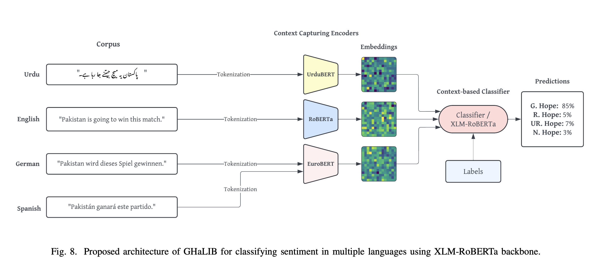

# GHaLIB غالب: A Multilingual Framework for Hope Speech Detection in Low-Resource Languages



GHaLIB is a multilingual framework for **hope speech detection** designed to address linguistic nuance, cultural variation, and data scarcity in **low-resource languages**. The framework combines **language-specific encoders** with a **shared multilingual transformer backbone** to improve both binary and fine-grained (multiclass) hope speech classification across multiple languages.

This work was developed and evaluated as part of the **PolyHope-M 2025** shared task and accepted at **ACIT 2025**.

---

## Problem Statement

Hope speech is a distinct NLP task that goes beyond sentiment analysis. While sentiment focuses on present emotional polarity, hope speech captures **future-oriented belief**, often expressed through subtle, context-dependent language. This makes it especially difficult to detect in multilingual and low-resource settings.

Key challenges addressed by GHaLIB include:
- Over-reliance of existing research on English
- Limited datasets for hope speech in low-resource languages
- Lexical overlap between hope, sarcasm, and negative statements
- Failure of traditional machine learning methods to capture context and pragmatics
- Lack of scalable multilingual frameworks for nuanced hope detection

---

## Hope Speech Categories

The framework follows the standard four-class taxonomy used in PolyHope:

- **Generalized Hope**: Broad belief that things will improve  
  Example: “Things will get better over time.”

- **Realistic Hope**: Hope grounded in plausible conditions or effort  
  Example: “I can pass the exam if I study hard.”

- **Unrealistic Hope**: Hope for an implausible or impossible outcome  
  Example: “If I jump high enough, I can reach the moon.”

- **Not Hope**: Absence of hope or unrelated content  
  Example: “Nothing is going to change.”

---

## Architecture Overview

GHaLIB integrates language-aware and multilingual representations in a single pipeline:

- **Language Identification** routes input text to an appropriate encoder.
- **Language-Specific Encoders** capture morphological, syntactic, and cultural features:
  - Urdu: UrduBERT
  - English: RoBERTa
  - German & Spanish: EuroBERT
- **Shared Multilingual Backbone**: XLM-RoBERTa provides cross-lingual semantic alignment.
- **Fusion Strategy**: CLS embeddings from the language-specific encoder and XLM-RoBERTa are concatenated and passed to a context-aware classifier.

This design enables strong performance in both high-resource and low-resource settings while remaining computationally feasible.

---

## Dataset

Experiments are conducted on the **PolyHope-M 2025** multilingual corpus, which includes annotated social media text in:

- Urdu
- English
- German
- Spanish

The dataset exhibits notable **class imbalance**, with *Not Hope* being the dominant category, and significant variation in text length and vocabulary across languages.

---

## Training Setup

- Stratified 70/15/15 train–validation–test split
- Weighted cross-entropy loss to mitigate class imbalance
- Hyperparameter tuning using Optuna (30 trials)
- Maximum sequence length: 128 tokens
- Training performed on 2×16GB NVIDIA T4 GPUs
- Fixed random seeds for reproducibility
- Final evaluation conducted on the official hidden PolyHope-M benchmark

---

## Results

### Binary Classification (Hope vs Not Hope)

| Language | F1-score |
|--------|----------|
| Urdu | 95.0 |
| English | 86.3 |
| German | 87.4 |
| Spanish | 85.0 |

Binary classification benefits from shared multilingual representations and shows strong generalization across languages, with particularly high performance for Urdu.

---

### Multiclass Classification (4 Classes)

| Language | Macro F1-score |
|--------|----------------|
| Urdu | 65.2 |
| English | 71.0 |
| German | 70.1 |
| Spanish | 68.5 |

Multiclass classification remains challenging due to overlapping vocabulary and subtle pragmatic distinctions between hope categories. Nevertheless, GHaLIB achieves state-of-the-art results across all evaluated languages.

---

## Key Observations

- Language-specific encoders significantly improve performance for morphologically rich and low-resource languages, particularly Urdu and German.
- Multilingual transformers generalize well in binary classification tasks.
- English benefits from richer pretraining resources, but hybrid modeling reduces the performance gap for low-resource languages.
- Most classification errors arise from code-mixed text and contextual ambiguity rather than model instability.

---

## Limitations

- Code-mixed inputs remain difficult to classify reliably.
- Multiclass hope detection is inherently ambiguous due to subjective and pragmatic factors.
- Language identification errors can occur, though their impact is mitigated by the multilingual backbone.

These limitations reflect open challenges in hope speech detection rather than architectural deficiencies.

---

## Future Work

- Extension to additional low-resource languages such as Punjabi, Sindhi, and Seraiki
- Improved handling of code-mixing and pragmatic ambiguity
- Exploration of parameter-efficient fine-tuning and domain-specific pretraining
- Investigation of more advanced representation fusion strategies

---

## Citation

If you use this work, please cite:

```

@inproceedings{abdullah2025ghalib,
title={GHaLIB: A Multilingual Framework for Hope Speech Detection in Low-Resource Languages},
author={Ahmed Abdullah and Haroon Mahmood and Sana Fatima},
booktitle={International Arab Conference on Information Technology (ACIT)},
year={2025}
}

```

